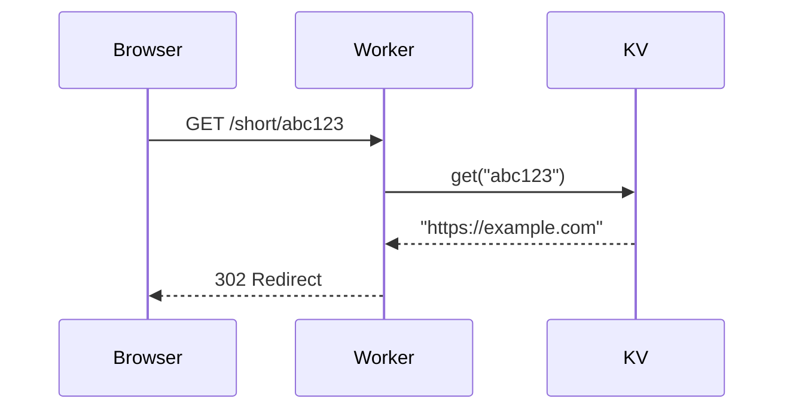

# Cloudflare Learn to Code - Program Design

> Internal training to take non-technical Cloudflare employees from zero to building real products on the Cloudflare stack.

---

## Program Overview

| Attribute | Value |
|-----------|-------|
| **Duration** | 12 weeks |
| **Sessions per week** | 4 |
| **Session length** | 60 minutes |
| **Format** | Instructor-led, 1:1 or 1:2 |
| **Tools** | Windsurf, OpenCode, Wrangler, Git/GitHub |
| **End goal** | Build sophisticated apps and agents on Cloudflare |

---

## Session Structure

Every session follows this format:

```
┌─────────────────────────────────────────────────────────────┐
│  0:00 - 0:15  │  INTRO (Instructor-Led)                     │
│               │  - Review yesterday's build                 │
│               │  - Introduce today's concept                │
│               │  - Demo what we're building                 │
│               │  - Explain-back moment from learner         │
├───────────────┼─────────────────────────────────────────────┤
│  0:15 - 0:45  │  BUILD (Hands-On)                           │
│               │  - Work through worksheet/starter files     │
│               │  - Instructor guides, learner types         │
│               │  - Checkpoints throughout                   │
│               │  - Commit progress as you go                │
├───────────────┼─────────────────────────────────────────────┤
│  0:45 - 1:00  │  REVIEW (Instructor-Led)                    │
│               │  - Sync: What did you build?                │
│               │  - Visual checkpoint (diagram/mermaid)      │
│               │  - Quick quiz (3-5 questions)               │
│               │  - Preview tomorrow                         │
│               │  - Final commit + push                      │
└─────────────────────────────────────────────────────────────┘
```

---

## Core Principles

### 1. Tools First, Then Code
Week 1 is purely about tools - terminal, editor, git. No code logic yet. Get comfortable with your environment.

### 2. Understand Before You Deploy
Learn programming fundamentals locally with Node.js (Weeks 2-4). Only deploy to Workers (Week 5+) after you understand what the code does. No black boxes.

### 3. Understand Everything
No black boxes. No magic. Every line of code gets typed and explained. If you can't explain it, you don't move on.

### 4. Output Every Day
Every 60-minute session produces something tangible. A working feature, a deployed change, a completed component.

### 5. Incremental Complexity
Each day builds on the last. No leaps. Complexity increases gradually through repetition and extension.

### 6. Habits Over Topics
Git, terminal, and good practices become muscle memory through daily repetition - not separate "topics" to cover.

---

## Pedagogical Techniques

Use these throughout, especially in the first and last 15 minutes:

### Explain-Back Moments
Before moving on, learner explains what just happened in their own words.
> "In your words, what did that function do?"

### Visual Checkpoints
Draw or diagram what you just built. Use Mermaid in the README or whiteboard.
> "Let's sketch the data flow before we add the next piece."

### Quick Quizzes
3-5 rapid questions at end of session to reinforce concepts.
> "What HTTP method did we use? What would happen if we changed X?"

### "What Would Break If..."
Hypothetical questions to test mental model.
> "What would break if we removed this line?"

### Type Everything
Learner types all code. No copy-paste of logic. Muscle memory matters.

### Predict Then Verify
Before running code, learner predicts what will happen.
> "What do you think we'll see when we run this?"

---

## AI Usage Ethos

### The Philosophy
AI tools (Windsurf, OpenCode) should be used to their maximum potential - but carefully. The goal is to become an excellent **AI operator**, not to have AI replace understanding.

### The Pattern: Manual First, Then AI
1. **Build it manually first** - Understand what you're doing, line by line
2. **Rebuild with AI** - See how AI approaches the same problem
3. **Compare and reflect** - What did AI do differently? Better? Worse?
4. **Synthesize** - Develop intuition for when and how to use AI effectively

### What AI Is For
- Explaining errors you don't understand
- Generating boilerplate you've already mastered conceptually
- Suggesting approaches when you're stuck
- Accelerating repetitive tasks
- Rubber-ducking your thinking

### What AI Is NOT For
- Writing core logic before you understand it
- Skipping the learning process
- Avoiding debugging (debugging teaches more than success)
- Replacing your own thinking

### AI Operator Mindset
An AI operator:
- Knows what to ask for
- Can evaluate if the output is correct
- Understands the code well enough to modify it
- Uses AI to go faster, not to avoid understanding
- Treats AI as a junior pair programmer, not an oracle

---

## Git Integration

Git is used from Day 1. It's not a topic - it's a habit.

### Daily Git Rhythm
1. Session starts: `cd` into the right directory
2. Throughout build: Commit at checkpoints
3. Session ends: Final commit + push

### Every Day Has
```
week-XX-topic/
├── day-Y-subtopic/
│   ├── README.md          # Session guide, learning objectives, steps
│   ├── AGENTS.md          # AI usage hints for this session
│   ├── QUIZ.md            # End-of-session quiz questions
│   ├── starter/           # Files learner starts with
│   └── answers/           # Completed version for reference
```

### Git Commands Introduced Gradually
| Week | New Git Concepts |
|------|------------------|
| 1 | `git init`, `git add`, `git commit`, `git push` |
| 2-3 | `git status`, `git log`, `git diff` |
| 4-5 | Branching: `git branch`, `git checkout` |
| 6+ | Pull requests, reviewing changes |

---

## Terminal Accumulation

Terminal skills build up through daily use, not dedicated lessons.

### Week 1 Commands
- `cd` - Navigate directories
- `ls` - List files
- `mkdir` - Create directories
- `rm` - Remove files
- `cat` - View file contents
- `code .` / `cursor .` - Open editor

### Accumulated by Week 6
- `npm init`, `npm install`, `npm run`
- `npx wrangler` commands
- `git` commands
- Piping and basic shell patterns

### Reference Card
Each week's README includes a "Terminal Commands This Week" section that grows.

---

## Visual Thinking

Use Mermaid diagrams in READMEs to visualize:
- Data flow
- Request/response cycles
- System architecture
- State changes

### Example


Learners create these diagrams as part of the "visual checkpoint" in review.

---

## Agent Journey

### Progression
| Weeks | Exposure |
|-------|----------|
| 1-4 | **Using AI tools** - Windsurf and OpenCode help you build |
| 5-6 | **Concepts introduced** - What is an agent? What are tools? How do LLMs work? |
| 7-8 | **See agents work** - Understand the reasoning loop, observe tool use |
| 9-10 | **Build simple agents** - 2-3 tools, basic orchestration |
| 11-12 | **Sophisticated agents** - Full agent with planning, error recovery, deployment |

### By Week 12, Learners Understand
- What an LLM is and how it works (conceptually)
- What embeddings and vectors are
- How RAG retrieval works
- What tools/function calling means
- How agents reason and act
- How to build and deploy an agent on Cloudflare

---

## Weekly Arc (High-Level)

| Week | Theme | Capstone |
|------|-------|----------|
| 1 | First site live | Personal page deployed to Pages |
| 2 | Interactive pages | Quiz or calculator on GitHub |
| 3 | JavaScript fundamentals | Feature-rich interactive app |
| 4 | Data & persistence | Todo app with localStorage |
| 5 | APIs & fetching | Dashboard with live data |
| 6 | How the internet works | System diagram + authenticated API |
| 7 | First Worker | API deployed to edge |
| 8 | Workers + KV | URL shortener |
| 9 | Full-stack + intro to agents | Link-in-bio app |
| 10 | Databases & real-time | Collaborative app with D1 |
| 11 | AI on the edge | RAG knowledge base |
| 12 | Agents & capstone | Full agent deployed |

---

## Cloudflare Stack Coverage

By program end, learners have hands-on experience with:

| Product | Week Introduced | Use Case |
|---------|-----------------|----------|
| **Pages** | Week 1 | Static site hosting |
| **Workers** | Week 7 | Serverless functions at edge |
| **KV** | Week 8 | Key-value storage |
| **D1** | Week 10 | SQL database |
| **Durable Objects** | Week 10 | Stateful coordination, real-time |
| **Workers AI** | Week 11 | LLM inference at edge |
| **Vectorize** | Week 11 | Vector database for RAG |

---

## Success Criteria

A session is successful when:
- [ ] Working code: Something runs or deploys
- [ ] Committed: Changes pushed to GitHub  
- [ ] Can explain: Learner articulates what they built
- [ ] Quiz passed: 4/5 or better on end-of-session quiz

A week is successful when:
- [ ] Capstone complete: Week's main project works
- [ ] Cumulative understanding: Can explain how this week connects to previous

---

## Repository Structure

```
Curriculum/
├── README.md                    # Program overview, how to use
├── planning.md                  # This document
├── SETUP.md                     # One-time environment setup
├── INSTRUCTOR_GUIDE.md          # How to facilitate sessions
│
├── week-01-first-site/
│   ├── README.md                # Week overview
│   ├── day-1-terminal-basics/
│   │   ├── README.md            # Session guide
│   │   ├── AGENTS.md            # AI hints
│   │   ├── QUIZ.md              # Quiz questions
│   │   ├── starter/
│   │   └── answers/
│   ├── day-2-first-html/
│   ├── day-3-css-styling/
│   └── day-4-deploy-live/
│
├── week-02-.../
└── ... (weeks 3-12)
```

---

## Open Decisions

Items still to resolve:

- [ ] Specific quiz format (multiple choice? short answer? code completion?)
- [ ] How to handle learners at different paces (stretch goals? skip ahead?)
- [ ] Certification or completion tracking?
- [ ] Feedback mechanism (how do we improve the curriculum?)

---

## Next Steps

1. ~~Create planning.md~~ Done
2. Build out Week 1 as detailed prototype
3. Test with 1-2 learners
4. Iterate based on feedback
5. Build remaining weeks

---

*Last updated: 2026-03-03*
